# 鸟之道

## 项目成员信息

成员均来自 NCWU 的 wqKang 开发组：

- 202107927 康问樵
- 202109723 傅家俊

## 联系方式

如有任何问题或建议，请通过邮件联系：wenqiaokang@outlook.com

​	本项目是一个基于Streamlit的交互式应用程序，旨在通过图像识别和自然语言处理技术提高用户对鸟类的认知和了解。应用程序的核心功能包括：

1. **图像识别：** 使用训练和优化过的YOLOv8模型对用户上传的鸟类图片进行对象检测，准确识别出图片中的鸟类种类。

2. **科普知识生成：** 利用经过微调的ChatGLM2语言模型，根据图像识别结果生成关于检测到的鸟类的科普描述。这一步骤旨在提供更多关于识别鸟类的背景信息和有趣的科学知识。

3. **交互式用户界面：** 通过Streamlit构建的前端界面，用户可以直观地上传图片、触发图像识别过程，并接收包括鸟类识别结果和相关科普信息在内的反馈。

4. **知识库整合：** 项目还探讨了如何结合本地知识库进行更精准和个性化的问答服务。这一功能通过LangChain框架和CHATGLM模型实现，进一步扩展了应用程序的能力，允许用户基于上传的文档资料获得定制化的问答服务。

​		总之，该项目结合了最新的AI技术和用户友好的界面设计，为用户提供了一个易于使用的平台，通过图像识别和语言模型生成的科普知识，增进用户对鸟类的认识。这不仅展示了AI在自然界探索和教育领域的潜力，也为普及科学知识提供了新途径。

## 鸟类图像识别及科普描述

​		基于 Streamlit 的交互式应用程序，用于对象检测。主要功能包括从图像检测物体，并使用 YOLOv8 模型进行目标检测。当用户上传鸟类照片，系统会利用 YOLOv8 进行图像识别，同时使用 ChatGLM2 语言模型提供相关科普描述。识别结果和位置会显示在界面上，并形成一个问题，送入 ChatGLM2，生成鸟类的科普描述，最后通过界面展示给用户。

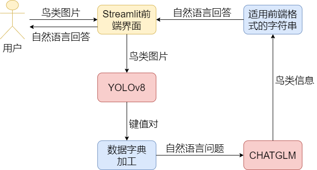

​		首先进入Streamlit的前端界面

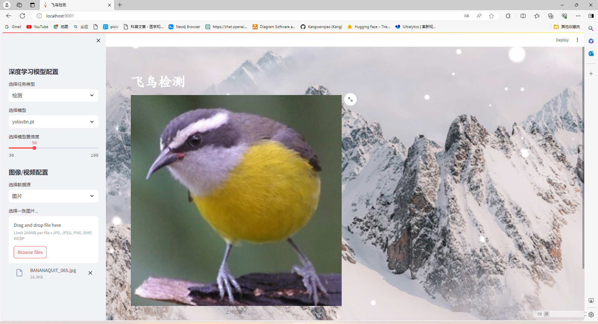

​		在后端，首先加载了经过微调的 ChatGLM2 语言模型，这个模型用于生成科普描述。接着加载了针对鸟类识别进行训练和减枝的 YOLOv8 目标识别模型，用于识别鸟类。

```cmd
Loading checkpoint shards: 100%|███████████████████████████████████████████████████████████████████████████████████████████████████████████████████████████████████████████████████████████████████████████| 7/7 [00:06<00:00,  1.13it/s]
Some weights of ChatGLMForConditionalGeneration were not initialized from the model checkpoint at /home/hk/.cache/modelscope/hub/ZhipuAI/chatglm2-6b and are newly initialized: ['transformer.prefix_encoder.embedding.weight']
You should probably TRAIN this model on a down-stream task to be able to use it for predictions and inference.
weights/detection/yolov8n.pt

```

​		用户点击“开始识别”按钮后，系统将对上传的鸟类照片进行分析。首先，系统使用 YOLOv8 模型识别照片中的鸟类种类，并将结果显示在界面上。然后，系统利用 ChatGLM2 语言模型生成该鸟类的科普描述，并将描述展示给用户。这样，用户可以通过系统了解照片中鸟类的种类以及相关的科学知识。

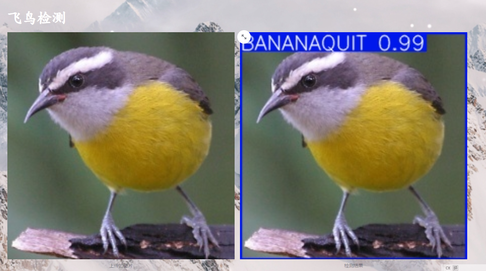

​		在这一步，系统使用 YOLOv8 模型对上传的鸟类照片进行识别。通过该模型，系统能够确定照片中鸟类的名称以及它们在图片中的相对位置。这些识别结果将被用于后续的处理，例如生成科普描述或在界面上展示给用户。

```cmd
0: 640x640 1 BANANAQUIT, 13.5ms
Speed: 8.0ms preprocess, 13.5ms inference, 4.3ms postprocess per image at shape (1, 3, 640, 640)
{'BANANAQUIT': 1}

```

以下是chatglm的官方调用方式

```python
from transformers import AutoTokenizer, AutoModel
tokenizer = AutoTokenizer.from_pretrained("THUDM/chatglm2-6b", trust_remote_code=True)
model = AutoModel.from_pretrained("THUDM/chatglm2-6b", trust_remote_code=True, device='cuda')
model = model.eval()
response, history = model.chat(tokenizer, "你好", history=[])
print(response)
你好👋!我是人工智能助手 ChatGLM2-6B,很高兴见到你,欢迎问我任何问题。
response, history = model.chat(tokenizer, "晚上睡不着应该怎么办", history=history)
print(response)
晚上睡不着可能会让你感到焦虑或不舒服,但以下是一些可以帮助你入睡的方法:

1. 制定规律的睡眠时间表:保持规律的睡眠时间表可以帮助你建立健康的睡眠习惯,使你更容易入睡。尽量在每天的相同时间上床,并在同一时间起床。
2. 创造一个舒适的睡眠环境:确保睡眠环境舒适,安静,黑暗且温度适宜。可以使用舒适的床上用品,并保持房间通风。
3. 放松身心:在睡前做些放松的活动,例如泡个热水澡,听些轻柔的音乐,阅读一些有趣的书籍等,有助于缓解紧张和焦虑,使你更容易入睡。
4. 避免饮用含有咖啡因的饮料:咖啡因是一种刺激性物质,会影响你的睡眠质量。尽量避免在睡前饮用含有咖啡因的饮料,例如咖啡,茶和可乐。
5. 避免在床上做与睡眠无关的事情:在床上做些与睡眠无关的事情,例如看电影,玩游戏或工作等,可能会干扰你的睡眠。
6. 尝试呼吸技巧:深呼吸是一种放松技巧,可以帮助你缓解紧张和焦虑,使你更容易入睡。试着慢慢吸气,保持几秒钟,然后缓慢呼气。

如果这些方法无法帮助你入睡,你可以考虑咨询医生或睡眠专家,寻求进一步的建议。
```

​		以下代码会首先遍历 YOLO 模型的预测结果，提取检测到的鸟类名称及其数量，并构建一个问题字符串。然后，该问题字符串将通过 ChatGLM 官方调用方式传递给语言模型，以获取生成的科普描述。最后，将生成的描述字符串转换为字符串形式，以便在 Streamlit 界面上显示给用户。

```python
                res = model.predict(uploaded_image,conf=conf)

                # res_class=model.predict(uploaded_image,conf=conf,save=True)
                # print(res_class)
                # print(source_img)


                # 初始化一个字典来存储检测到的对象名称和数量
                detected_objects = {}

                # 遍历检测到的所有对象
                for box in res[0].boxes:
                    # 获取类别ID，并确保它是一个整数
                    class_id = box.cls.item()  # 使用.item()方法从张量中获取Python整数
                    # 使用names字典获取类别名称，确保使用整数索引
                    class_name = res[0].names[class_id]

                    # 统计每个类别的对象数量
                    if class_name in detected_objects:
                        detected_objects[class_name] += 1
                    else:
                        detected_objects[class_name] = 1

                print(detected_objects)
                unique_object = list(detected_objects.keys())[0]
                unique_object_str = str(unique_object)

                question="请告诉我些关于"+f"{unique_object_str}"+"的知识吧？"
                #将问题输送给大语言模型
                response=display_answer(llm_tokenizer,llm_model,question)
                response=str(response)
```

​		当获得了来自 ChatGLM 的响应后，通过 Streamlit 将响应字符串传送给前端界面。

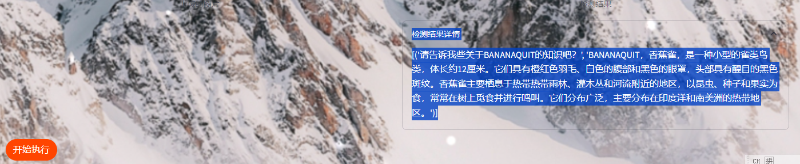

​    	

## 多功能智能问答

​		这个项目是一个基于最新人工智能技术的智能问答系统，它结合了 LangChain 框架、CHATGLM 对话模型和 Streamlit 前端技术。通过这一集成方案，项目旨在为用户提供一个高度交互式的平台，使他们能够上传自己的文档资料，并基于这些资料获得精准、相关的问答服务。

1. **LangChain 框架：**作为项目的技术支柱，LangChain 提供了与语言模型交互的必要组件和抽象。它使得开发者能够方便地将语言模型连接到其他数据源，并创建能与环境互动的智能应用。
2. **CHATGLM 模型：**作为对话处理的核心，CHATGLM 是一个开源的、支持中英文双语的对话语言模型，专为对话优化，能在本地环境中高效运行。它通过学习用户提供的文档资料中的词向量，能够提供更加贴近用户需要的答案。
3. **Streamlit 前端：**通过 Streamlit 构建的用户界面简洁直观，允许用户轻松上传文档、提交查询并接收回答。Streamlit 的互动性增强了用户体验，使得非技术用户也能无障碍使用系统。
4. **文档处理与知识库构建：**项目利用特定模型（ m3e-base）处理用户上传的文档，并构建词向量，形成一个本地知识库。这个知识库不仅加深了系统对用户文档内容的理解，也使得 CHATGLM 能够在回答时参考这些内容，从而提供更加精确和个性化的回答。


#### 单纯的llm模型问答

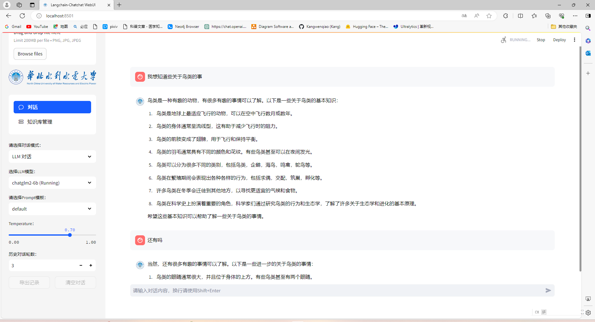

可以看到，回答比较宽泛，只是单纯通过CHATGLM生成的答复。不足以满足一些对于鸟类知识相对了解的用户，以下是一种更好的方案。

#### 结合本地知识库的问答

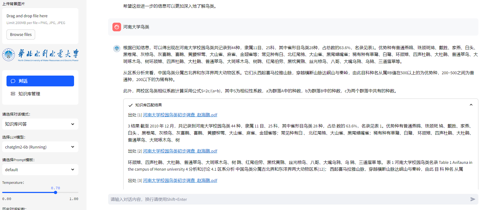

结合了本地知识库，所有的回答都变得有依据。通过以下界面可以自定义自己的知识库，包括生成新的知识库，向知识库中上传文档。

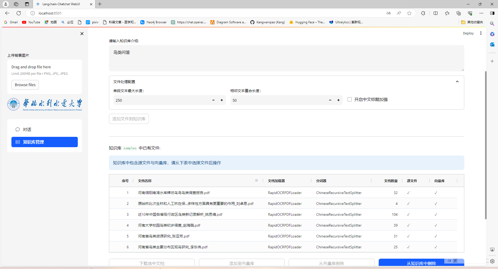


## 涉及到的模型的训练和微调核心

### YOLOv8训练与减枝

​		对于YOLOv8的模型我们使用的是来自Kaggle的BIRDS 525 SPECIES- IMAGE CLASSIFICATION数据集，其中原本有525种鸟类的分类及图像，但是由于GPU以及设备性能问题我们就只挑选了161种鸟类（数据集中train、test、valid图片最多的优先选择），构建名称到编号的索引并将其加工为coco2017数据集的格式。


数据集根目录格式

```目录格式
---images
      --train
      --val
      --test
---labels
      --train
      --val
      --test
```

数据集标签格式

```txt
class_id x_center  y_center  w  h
```

​		对于 YOLOv8 进行减枝的目的是为了在保持模型性能的前提下，提高模型的推理速度和资源利用效率，从而更好地满足不同应用场景的需求。为了使得YOLOv8保证模型的效果，在进行减枝前需要进行约束性训练。

​		在[tensorboard可视化](https://so.csdn.net/so/search?q=tensorboard可视化&spm=1001.2101.3001.7020)约束训练过程BN参数的分布变化，随着训练进行（纵轴是epoch），BN层参数会逐渐从最上面的正太分布趋向于0附近。以下是正常训练和稀疏训练的BN层参数值的分布图：

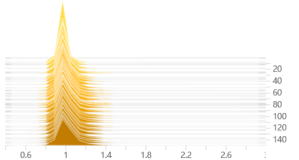

​                                                                                                                         上图为正常训练

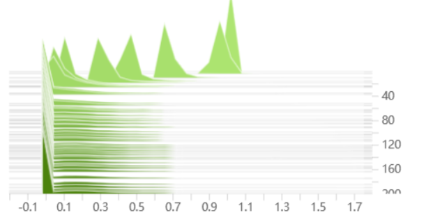

​                                                                                                                        上图为稀疏训练

​		以上的稀疏训练明显太早就全到0了，这样会影响精度，可以把系数1e-2改小一点1e-3，这样会稀疏的慢一点，如下图左为1e-2, 右为0.3*1e-2


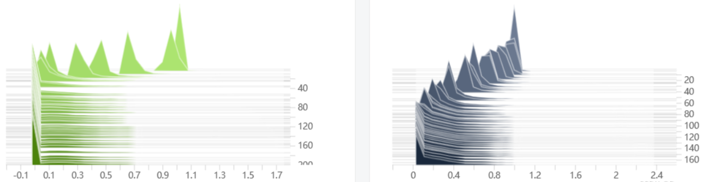

​		修改系数1e-2为1e-3将会使稀疏化的速度减慢，因为它将影响到L1正则化的强度，从而减缓权重稀疏化的速度。这样做的好处是权重稀疏化过程更加平滑，可以在一定程度上减少对模型精度的影响。

​		具体来说，通过将l1_lambda的计算方式修改为 
$$
l1_lambda = 1e-2 * (1 - 0.9 * epoch / self.epochs)
$$
​		随着epoch的增加，l1_lambda的值会从初始值1e-2逐渐减小，直到训练结束。这样可以使得正则化的强度随着训练的进行逐渐减小，从而减缓权重稀疏化的速度。

​		这种修改的好处在于，在训练早期，模型的权重将更少地受到正则化的影响，从而有助于保持模型的精度。而在训练后期，随着l1_lambda逐渐减小，模型的权重将更多地向稀疏方向演化，实现权重的稀疏化。这样可以更好地平衡模型的稀疏化和精度之间的关系，提高模型的训练效果。

#### 减枝主要代码

```python

from ultralytics import YOLO
import torch
from ultralytics.nn.modules import Bottleneck, Conv, C2f, SPPF, Detect
 
# Load a model
yolo = YOLO("last.pt")
model = yolo.model
 
ws = []
bs = []
 
for name, m in model.named_modules():
    if isinstance(m, torch.nn.BatchNorm2d):
        w = m.weight.abs().detach()
        b = m.bias.abs().detach()
        ws.append(w)
        bs.append(b)
        # print(name, w.max().item(), w.min().item(), b.max().item(), b.min().item())
# keep
factor = 0.8
ws = torch.cat(ws)
threshold = torch.sort(ws, descending=True)[0][int(len(ws) * factor)]
print(threshold)
 
def prune_conv(conv1: Conv, conv2: Conv):
    gamma = conv1.bn.weight.data.detach()
    beta = conv1.bn.bias.data.detach()
    keep_idxs = []
    local_threshold = threshold
    while len(keep_idxs) < 8:
        keep_idxs = torch.where(gamma.abs() >= local_threshold)[0]
        local_threshold = local_threshold * 0.5
    n = len(keep_idxs)
    # n = max(int(len(idxs) * 0.8), p)
    # print(n / len(gamma) * 100)
    # scale = len(idxs) / n
    conv1.bn.weight.data = gamma[keep_idxs]
    conv1.bn.bias.data = beta[keep_idxs]
    conv1.bn.running_var.data = conv1.bn.running_var.data[keep_idxs]
    conv1.bn.running_mean.data = conv1.bn.running_mean.data[keep_idxs]
    conv1.bn.num_features = n
    conv1.conv.weight.data = conv1.conv.weight.data[keep_idxs]
    conv1.conv.out_channels = n
 
    if conv1.conv.bias is not None:
        conv1.conv.bias.data = conv1.conv.bias.data[keep_idxs]
 
    if not isinstance(conv2, list):
        conv2 = [conv2]
 
    for item in conv2:
        if item is not None:
            if isinstance(item, Conv):
                conv = item.conv
            else:
                conv = item
            conv.in_channels = n
            conv.weight.data = conv.weight.data[:, keep_idxs]
 
 
def prune(m1, m2):
    if isinstance(m1, C2f):  # C2f as a top conv
        m1 = m1.cv2
 
    if not isinstance(m2, list):  # m2 is just one module
        m2 = [m2]
 
    for i, item in enumerate(m2):
        if isinstance(item, C2f) or isinstance(item, SPPF):
            m2[i] = item.cv1
 
    prune_conv(m1, m2)
 
 
for name, m in model.named_modules():
    if isinstance(m, Bottleneck):
        prune_conv(m.cv1, m.cv2)
 
seq = model.model
for i in range(3, 9):
    if i in [6, 4, 9]: continue
    prune(seq[i], seq[i + 1])
 
detect: Detect = seq[-1]
last_inputs = [seq[15], seq[18], seq[21]]
colasts = [seq[16], seq[19], None]
for last_input, colast, cv2, cv3 in zip(last_inputs, colasts, detect.cv2, detect.cv3):
    prune(last_input, [colast, cv2[0], cv3[0]])
    prune(cv2[0], cv2[1])
    prune(cv2[1], cv2[2])
    prune(cv3[0], cv3[1])
    prune(cv3[1], cv3[2])
 
for name, p in yolo.model.named_parameters():
    p.requires_grad = True
 
# yolo.val() # 剪枝模型进行验证 yolo.val(workers=0)
yolo.export(format="onnx") # 导出为onnx文件
# yolo.train(data="VOC.yaml", epochs=100) # 剪枝后直接训练微调
 
torch.save(yolo.ckpt, "prune.pt")
print("done")
```

运行完会得到prune.pt和prune.onnx可以在netron.app网站拖入onnx文件查看是否剪枝成功了，成功的话可以看到某些通道数字为单数或者一些不规律的数字。

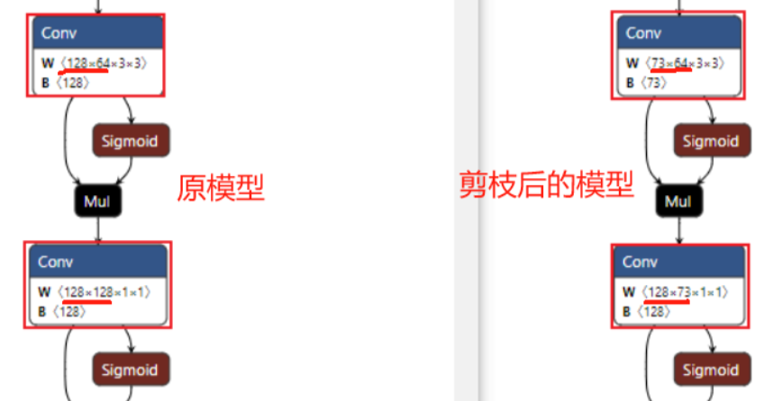

#### 进行finetun训练，通过恢复训练使得模型map回调。

以下是减枝完后模型，剪枝前后各层通道数对比

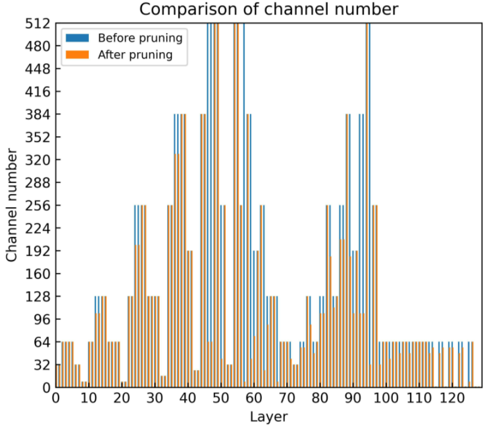

### CHATGLM微调

​		数据集为我们自己构建，通过使用chatgpt4这种更先进的智能问答模型，结合我们通过网络搜寻的关于那161类鸟类的信息。先让chatgpt4学习我们搜寻到的信息然后让其按照standford-alpaca格式生成数据集并切割为训练集和验证集。

```json
{
    "instruction": "你好",
    "input": "",
    "output": "我是deepbirds，NCWU的wqKang开发的问答机器人。"
}
```

#### 对CHATGLM进行P-Tuning v2微调

​		通过修改ptuning里的train.sh脚本进行微调。

​		`PRE_SEQ_LEN` 和 `LR` 分别是 soft prompt 长度和训练的学习率，可以进行调节以取得最佳的效果。P-Tuning-v2 方法会冻结全部的模型参数，可通过调整 `quantization_bit` 来被原始模型的量化等级，不加此选项则为 FP16 精度加载。

​		在默认配置 `quantization_bit=4`、`per_device_train_batch_size=1`、`gradient_accumulation_steps=16` 下，INT4 的模型参数被冻结，一次训练迭代会以 1 的批处理大小进行 16 次累加的前后向传播，等效为 16 的总批处理大小，此时最低只需 6.7G 显存。若想在同等批处理大小下提升训练效率，可在二者乘积不变的情况下，加大 `per_device_train_batch_size` 的值，但也会带来更多的显存消耗，请根据实际情况酌情调整。

本次微调结果

```json
{
    "epoch": 160.0,
    "train_loss": 0.22109756726026536,
    "train_runtime": 16630.9567,
    "train_samples": 300,
    "train_samples_per_second": 2.886,
    "train_steps_per_second": 0.18
}
```

####  微调后模型的调用

```python
# llm.py
import os
import torch
from transformers import AutoConfig, AutoModel, AutoTokenizer
from IPython.display import display, Markdown, clear_output
from more_gpu import load_model_on_gpus

class ModelLoader:
    def __init__(self, model_path="/home/hk/.cache/modelscope/hub/ZhipuAI/chatglm2-6b",
                 prefix_checkpoint_path="/home/hk/wqKang/ChatGLM2-6B/ptuning/output/adgen-chatglm2-6b-pt-128-2e-2/checkpoint-3000"):
        self.model_path = model_path
        self.prefix_checkpoint_path = prefix_checkpoint_path
        self.config = AutoConfig.from_pretrained(model_path, trust_remote_code=True, pre_seq_len=128)
        self.tokenizer = AutoTokenizer.from_pretrained(model_path, trust_remote_code=True)
        self.model = AutoModel.from_pretrained(model_path, config=self.config, trust_remote_code=True)

        self.load_prefix_state()

    def load_prefix_state(self):
        prefix_state_dict = torch.load(os.path.join(self.prefix_checkpoint_path, "pytorch_model.bin"))
        new_prefix_state_dict = {}
        for k, v in prefix_state_dict.items():
            if k.startswith("transformer.prefix_encoder."):
                new_prefix_state_dict[k[len("transformer.prefix_encoder."):]] = v
        self.model.transformer.prefix_encoder.load_state_dict(new_prefix_state_dict)
        self.model = self.model.half().cuda()
        self.model.transformer.prefix_encoder.float()
        self.model = self.model.eval()

    def get_model(self):
        return self.model
    def get_tokenizer(self):
        return self.tokenizer
# Assuming display_answer is already provided and uses the model and tokenizer correctly


# Instantiate the ModelLoader and make it available for import
model_loader = ModelLoader()

```

```python
from putting import model_loader
import os
import torch
from transformers import AutoConfig, AutoModel, AutoTokenizer
from IPython.display import display, Markdown, clear_output

def display_answer(tokenizer,model, query, history=[]):
    # This is where your existing implementation of display_answer goes
    # For example:
    for response, history in model.stream_chat(tokenizer, query, history=history):
        clear_output(wait=True)
        display(Markdown(response))
    return history

```

```python
from llm import model_loader
# 获取 tokenizer 和 model
llm_tokenizer = model_loader.get_tokenizer()
llm_model = model_loader.get_model()
question="请告诉我些关于"+f"{unique_object_str}"+"的知识吧？"
response=display_answer(llm_tokenizer,llm_model,question)
response=str(response)
print(response)
```


